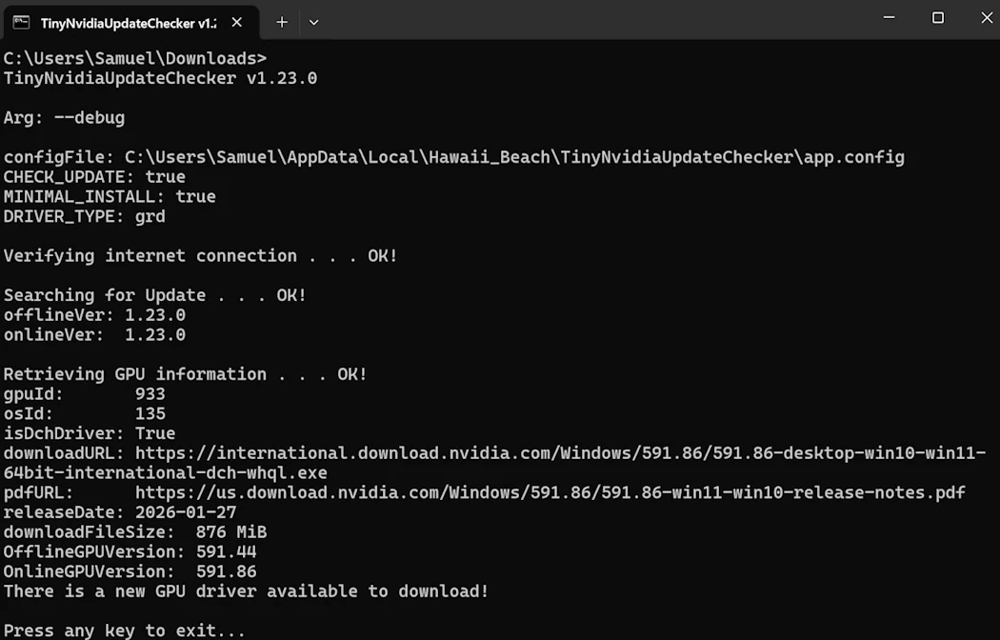

# THE NVIDIA GPU update checker for Windows power users/gamers

The best and __most popular__ open-sourced utility to check for NVIDIA GPU updates.

Made by Windows power users, to Windows power users.

## Main features

### Lightweight, portable and fully open-sourced

Alternatives are either bloated, or not open-sourced, or both. They are a security vulnerability waiting to happen.

Or they require you to install them, and cannot be run in portable mode - leaving a lot of trash files in your PC.

Some even require admin permissions to run (!!).

### Debloats the driver install

Stops the NVIDIA spyware from being installed on your computer. You choose EXACTLY which components of the driver you actually want to install.

No bloatware gets installed.

## Dependencies

- Windows 10 or higher
- [.NET Desktop Runtime 8 x64](https://dotnet.microsoft.com/en-us/download/dotnet/8.0) (it will be prompted to install if missing)
- Internet connection
- (optional) WinRAR, 7-Zip or NanaZip for minimal install feature (driver debloat)

## Installation

1. [Download the latest version](https://github.com/ElPumpo/TinyNvidiaUpdateChecker/releases)
2. Start TinyNvidiaUpdateChecker.exe
3. (Optional) Configure [execute when logging in](https://github.com/ElPumpo/TinyNvidiaUpdateChecker/wiki/Quiet-runs-on-user-login)

### Install with [Scoop](https://scoop.sh/#/apps?s=2&d=1&o=true&p=1&q=tinynvidiaupdatechecker)

```
scoop bucket add extras
scoop install tinynvidiaupdatechecker
```

### Install with [Windows Package Manager](https://github.com/microsoft/winget-pkgs)

```
winget source update
winget install Hawaii_Beach.TinyNvidiaUpdateChecker
```

## How to use

Be sure to [check out the wiki](https://github.com/ElPumpo/TinyNvidiaUpdateChecker/wiki) to learn more about how to use TNUC.

## Legal

### License

TinyNvidiaUpdateChecker - Check for NVIDIA GPU driver updates!

Copyright (C) 2016-present Hawaii_Beach

This program is free software: you can redistribute it And/Or modify it under the terms Of the GNU General Public License As published by the Free Software Foundation, either version 3 Of the License, Or (at your option) any later version.

This program is distributed In the hope that it will be useful, but WITHOUT ANY WARRANTY; without even the implied warranty Of MERCHANTABILITY Or FITNESS FOR A PARTICULAR PURPOSE. See the GNU General Public License For more details.

You should have received a copy Of the GNU General Public License along with this program. If Not, see <http://www.gnu.org/licenses/>.
